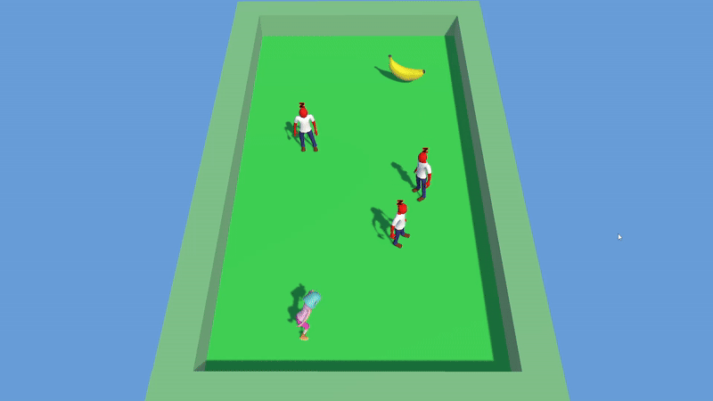

# 🎮 First Unity Game – Complete Project (Built From Scratch)

This project represents the first complete Unity game I built entirely from scratch within approximately one month.  
During the development process, I learned the full workflow of creating a game: from player movement to managers, from animations to prefabs, and from scene hierarchy to project structure.

It became my first “full pipeline” Unity experience.

---

## 🚀 Features & Gameplay Systems
- Player movement and animation system (Mixamo-based animations)
- Running mechanic (Left Shift sprint)
- Collectable system (Collectable Script + Manager)
- Enemy logic and chase behavior (Enemy Script + Manager)
- Game Director architecture (centralized logic controller)
- Random level generation on every restart (R key)
- UI system for score & game state
- Organized hierarchy with modular managers
- Prefab-based workflow
- Avatar & rig setup
- Optimized Unity project folder structure
- Clean and maintainable C# scripts

---

## 🧩 What I Learned
Through this project, I gained real experience in:

- Designing a scalable game hierarchy  
- Working with prefabs and reusable components  
- Managing scripts through single-responsibility managers  
- Implementing player/enemy interactions  
- Fruit collection → triggering enemy chase  
- Level reset & procedural-like randomization  
- Handling collisions and trigger events  
- Creating a game loop and directing systems via GameDirector  
- Integrating animations with Animator & Avatar workflows  
- Building Unity UI elements  
- Using Asset Store packages effectively  

This project significantly improved my understanding of Unity’s architecture.

---

## 🎮 How the Game Works (Gameplay Logic Overview)
- You control the player using **W / A / S / D**
- You can **run by holding Left Shift**
- A random fruit spawns at the beginning of the game
- When you collect the fruit, **enemies begin chasing you**
- Reach the **EXIT** door without getting caught to win
- If an enemy touches you → **Game Over**
- Press **R** at any time to:
  - Restart the level  
  - Respawn the player in a new random location  
  - Respawn the enemies randomly  
  - Spawn a random fruit type  
  - Start a fresh round

This makes every round slightly different — a mini-roguelike loop.

---

## ⌨️ In-Game Controls

| Key | Action |
|-----|--------|
| **W / A / S / D** | Move player |
| **Left Shift** | Run (Sprint) |
| **R** | Restart level with new random spawns |
| — | Collect fruit → Enemies start chasing |
| — | Reach EXIT → Win |

---

## 🖼️ GIF Previews (Gameplay Showcase)

### 🔁 Random Level Generation  

### 💥 Enemy Catch / Player Death  

### 🎬 Full Gameplay Loop  

---

## 📺 Resources & Tools Used
- **Unity 2022.x**
- **C# with Visual Studio 2022**
- **Mixamo** (animations & base model)
- **Unity Asset Store packages**
- **YouTube – Yakın Kampüs Unity Game Development Series**
- Unity UI system  
- Unity Animator & Avatar system  

---

## 📂 Project Structure
This repository includes the essential Unity folders:
- **Assets**
- **Packages**
- **ProjectSettings**

Unity will automatically generate the remaining folders when opening the project.

---

## 🎮 How to Run the Project
1. Clone or download the repository  
2. Open **Unity Hub**  
3. Click **Open Project**  
4. Select the project folder  
5. Press **Play**  

---

## 📦 Playable Build
A downloadable Windows Build will be added soon under the **Releases** tab.

---

## 👤 Author  
**Eren Yusuf Can**  
Software Engineering Student
